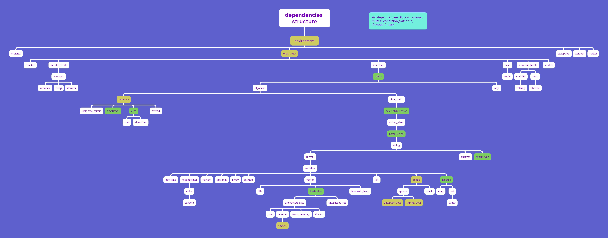

# MSTL V1.3.1

[](https://travis-ci.org/aurora250/MSTL)
[](https://opensource.org/licenses/MIT)

> 通过其他语言阅读: [English](README.EN.md)

本项目旨在建立一套供C++初学者学习并使用的、阅读性强的、较为健全的除并发库外的STL库，同时提供多种功能性接口。
本项目尽最大可能减少除并发库外的标准库的使用，尝试实现简化版本。
有劳各位多多issue，使本项目趋于健全。如有不足，还望斧正。

对初学者的建议学习方式：按照下文的文件介绍顺序阅读和使用，在疑惑的地方咨询同学或AI。

本库使用IO设备时默认您的操作系统为代码页为UTF-8，如不是，请尝试设置，否则可能在IO时乱码。

## 通过阅读和使用MSTL，您能学到什么？

- 使用`constexpr`与`if constexpr`减轻运行期负担；
- 使用`concept`与`requires`健壮代码；
- 强化`noexcept`保证；
- 使用可变参数模板、递归展开和模板特化等模板元技术实现类型萃取并编写功能性容器；
- 函数式编程设计和类型擦除设计；
- 使用编译器内置attribute优化代码行为；
- 区分`decltype`、`auto`与`template`的类型推导退化规则；
- 通过`enable_if`实现SFINAF(Substitution Failure Is Not An Error)；
- 通过`compressed_pair`实现EBCO(Empty Base Class Optimization)；
- 内存分配与就地构造的配合使用；
- UTF-8、UTF-16、UTF-32等不同字符编码类型间的转换规则；
- 使用`format`快速格式化字符串；
- 使用CRTP(Curiously Recurring Template Pattern)模板模式进行静态多态操作；
- 使用Windows与Linux原生接口实现`datetime`、`file`等工具类，认识两个OS之间大同小异的数据接口与数据处理方式；
- 双端队列、红黑树、哈希表等复杂容器的数据操作方式；
- 实现绝大部分标准算法(包括并发算法)与所有常用标准容器，并拓展部分教学用的非实用算法；
- 十余种通用排序函数的实现方式；
- 标准库并发接口的使用(`atomic`/`conditional_variable`/`thread`/`mutex`/`future`/`package_task`等)；
- MySQL、Redis接口的现代包装与使用；
- 设计轮询模式的线程池；
- socket封装现代风格servlet进行Web操作
  ......

## 支持环境

WINDOWS LINUX

X64 X86

MSVC GCC CLANG

C++ 14 17 20

## 编译指南

### 前置依赖

- CMake 3.17+
- 支持C++14及以上的编译器（GCC 12+、Clang 5+、MSVC 2017+）
- 可选依赖：
    - Boost
    - MySQL
    - SQLite3
    - hiredis
    - Qt6
    - CUDA Toolkit（仅MSVC）

请注意：本项目已停止对CUDA的支持，它被默认关闭依赖

### 编译步骤

您可以在项目根目录的CMakeLists.txt中开关依赖项并在src\CMakeLists.txt中直接更改您本地的依赖路径

- Windows

```bash
# 克隆最新发布版
git clone --depth 1 https://github.com/aurora250/MSTL.git
cd MSTL

# 创建构建目录
mkdir build && cd build

# 编译选项配置，您也可以在CMakeLists.txt内直接更改
cmake .. -G "Visual Studio 17 2022" -A x64 \
  -DMSTL_ENABLE_QT6=OFF \
  -DMSTL_BUILD_TESTS=ON \
  -DMYSQL_ROOT_DIR="C:/Program Files/MySQL/MySQL Server 8.0"

# 编译
cmake --build . --config Release

# 安装到系统目录
cmake --install . --config Release
```

- Linux

```bash
# 克隆最新发布版
git clone --depth 1 https://github.com/aurora250/MSTL.git
cd MSTL

# 创建构建目录
mkdir build && cd build

# 编译选项配置，您也可以在CMakeLists.txt内直接更改
cmake .. -DCMAKE_BUILD_TYPE=Release \
  -DMSTL_ENABLE_QT6=OFF \
  -DMSTL_BUILD_TESTS=ON

# 编译
make -j$(nproc)

# 安装到系统目录
sudo make install
```

## 文件介绍



以下按照上述文件结构层级依次介绍。

- [environment](include/MSTL/core/c++config.hpp)

定义操作系统平台、托管平台、总线宽度和C++版本的宏，实现多编译环境适配。

- [vsprintf](include/MSTL/core/vsprintf.hpp)

定义一系列函数将可变参数列表输出到格式化的字符串。

- [type_traits](include/MSTL/core/type_traits.hpp)

定义类型特征常量，使用模板元技术在编译期推断类型信息。

- [exception](include/MSTL/core/exception.hpp)

定义错误类型和快速调用宏，本项目的所有错误类型都为本文件内的错误类型。

- [random](include/MSTL/core/random.hpp)

定义假随机数生成类`random_lcd`、`random_mt`和基于硬件噪声的真随机数生成类`secret`。

- [socket](include/MSTL/web/socket.hpp)

定义网络套接字类`socket`。

- [functor](include/MSTL/core/functor.hpp)

定义仿函数和仿函数配接器（C++11后被标准弃用）。

- [iterator_traits](include/MSTL/core/iterator_traits.hpp)

定义迭代器萃取器`iterator_traits`及方便使用的类型别名。

- [interface](include/MSTL/core/interface.hpp)

定义一系列基础CRTP基类和基于其自动生成的全局函数。

- [hash](include/MSTL/core/hash.hpp)

定义基础类型的哈希函数及FNV等工具哈希函数。

- [numeric_limits](include/MSTL/core/numeric_limits.hpp)

定义数值类型信息类`numeric_limits`，在编译时提供数值类型的数学细节。

- [mutex](include/MSTL/core/mutex.hpp)

定义互斥锁`mutex`及作用域锁定类`lock_guard`。

- [concepts](include/MSTL/core/concepts.hpp)

定义常用的约束与迭代器类型判断特征常量。

- [utility](include/MSTL/core/utility.hpp)

定义压缩对`compressed_pair`、键值对`pair`及其哈希函数、类型擦除函数、C风格字符串转数字类型函数。

- [tuple](include/MSTL/core/tuple.hpp)

定义元组类`tuple`及其辅助函数。

- [mathlib](include/MSTL/core/mathlib.hpp)

定义常用的`constexpr`数学常量与函数。

- [ratio](include/MSTL/core/ratio.hpp)

定义比率类`ratio`。

- [numeric](include/MSTL/core/numeric.hpp)

定义数学算法。

- [heap](include/MSTL/core/heap.hpp)

定义普通heap算法。

- [iterator](include/MSTL/core/iterator.hpp)

定义迭代器工具函数和迭代器配接器。

- [algobase](include/MSTL/core/algobase.hpp)

定义比较、复制和移动算法。

- [any](include/MSTL/core/any.hpp)

定义任意类any，其可存储任意类型。

- [cstring](include/MSTL/core/cstring.hpp)

定义内存操作函数与C风格字符串操作函数。

- [memory](include/MSTL/core/memory.hpp)

定义内存操作函数、分配器类和智能指针类。

- [functional](include/MSTL/core/functional.hpp)

定义托管函数指针和类函数类型的函数类function。

- [algo](include/MSTL/core/algo.hpp)

定义判断、集合、查找、合并、移动、变换、绑定、排列等算法。

- [thread](include/MSTL/core/thread.hpp)

定义线程类`thread`。

- [sort](include/MSTL/ext/sort.hpp)

定义冒泡、鸡尾酒、选择、希尔、计数、桶、索引、归并、部分、快速、内省、提姆、猴子等多种排序算法。

- [algorithm](include/MSTL/core/algorithm.hpp)

引入基础算法和数学算法，定义并发算法，方便使用者引入。

- [char_traits](include/MSTL/core/char_traits.hpp)

定义字符串萃取类`basic_char_traits`及辅助萃取函数。

- [basic_string_view](include/MSTL/core/basic_string_view.hpp)

定义字符串视图基础类`basic_string_view`。

- [string_view](include/MSTL/core/string_view.hpp)

定义字符串视图类`string_view`。

- [basic_string](include/MSTL/core/basic_string.hpp)

定义基础字符串类`basic_string`。

- [string](include/MSTL/core/string.hpp)

定义字符串类`string`，提供不同字符编码间的转换函数。

- [format](include/MSTL/core/format.hpp)

定义字符串格式化辅助类`formatter`和格式化函数`format`。

- [encrypt](include/MSTL/core/encrypt.hpp)

定义字符加密类型及函数`XOR`、`base64`、`MD5`、`SHA1`、`SHA256`、`AES256`。

- [check_type](include/MSTL/core/check_type.hpp)

定义类型信息分析函数`check_type`，在多种编译器中规整类型信息。

- [serialize](include/MSTL/core/serialize.hpp)

定义一系列序列化的CRTP基类。

- [datetime](include/MSTL/core/datetime.hpp)

定义时间类`time`、日期类`date`、时期类`datetime`和UNIX时间戳类`timestamp`，提供方便操作的工具函数。

- [hexadecimal](include/MSTL/core/hexadecimal.hpp)

定义十六进制类`hexadecimal`及其格式化辅助类。

- [color](include/MSTL/core/color.hpp)

定义颜色类`color`。

- [console](include/MSTL/core/console.hpp)

定义IO辅助类`io_base`及IO控制台类`console`。

- [variant](include/MSTL/core/variant.hpp)

定义变体类`variant`，其可在同一块内存同时托管多个类型。

- [optional](include/MSTL/core/optional.hpp)

定义自选类`optional`，其可托管一个类型，设置可选空值nullopt。

- [array](include/MSTL/core/array.hpp)

定义数组类`array`，可以在编译器确定取值并更安全现代地操作数组。

- [bitmap](include/MSTL/core/bitmap.hpp)

定义位图类`bitmap`，它不作为`vector<bool>`特化存在。

- [vector](include/MSTL/core/vector.hpp)

定义向量类`vector`。

- [list](include/MSTL/core/list.hpp)

定义双向链表类`list`。

- [deque](include/MSTL/core/deque.hpp)

定义双端队列类`deque`，其可以使数据向前和向后O(1)插入。

- [rb_tree](include/MSTL/core/rb_tree.hpp)

定义红黑树类`rb_tree`，它被作为有序容器的代理类。

- [hashtable](include/MSTL/core/hashtable.hpp)

定义哈希表类`hashtable`，它被作为无序容器的代理类。

- [unordered_map](include/MSTL/core/unordered_map.hpp)

定义无序字典类`unordered_map`和无序多值字典类`unordered_multimap`。

- [unordered_set](include/MSTL/core/unordered_set.hpp)

定义无序集合类`unordered_set`和无序多值集合类`unordered_multiset`。

- [leonardo_heap](include/MSTL/ext/leonardo_heap.hpp)

定义莱昂纳多堆算法leonardo_heap。

- [queue](include/MSTL/core/queue.hpp)

定义队列类`queue`和基于普通堆算法heap的优先级队列类`priority_queue`。

- [stack](include/MSTL/core/stack.hpp)

定义栈类`stack`。

- [map](include/MSTL/core/map.hpp)

定义有序字典类`map`和有序多值字典类`multimap`。

- [set](include/MSTL/core/set.hpp)

定义有序集合类`set`和有序多值集合类`multiset`。

- [file](include/MSTL/core/file.hpp)

定义文件类`file`，其使用8KB的buffer以适应大批量小数据的读写。

- [json](include/MSTL/core/json.hpp)

定义JSON解析类`json_parser`和JSON构建类`json_builder`。

- [session](include/MSTL/web/session.hpp)

定义`cookie`类、会话类`session`和HTTP常量。

- [servlet](include/MSTL/web/servlet.hpp)

定义微服务类`servlet`，提供监听端口、配置filter、设置cookie、操作session属性等功能。

- [trace_memory](include/MSTL/ext/trace_memory.hpp)

定义基于boost的栈追踪分配器`trace_allocator`。

- [database_pool](include/MSTL/db/database_pool.hpp)

定义支持MySQL、Sqlite3、Redis链接的多态数据库连接及数据库链接池`database_pool`。

- [thread_pool](include/MSTL/core/thread_pool.hpp)

定义轮询线程池类`thread_pool`。

- [timer](include/MSTL/core/timer.hpp)

定义定时器类`timer`。

## 开源协议

本项目基于 [MIT 开源协议](LICENSE) 。

## 待实现功能

lib:
atomic
future
ranges
cuda-matrix
xml
yaml
postgresql

fix:
strong assert
strong serialize
support macOS
